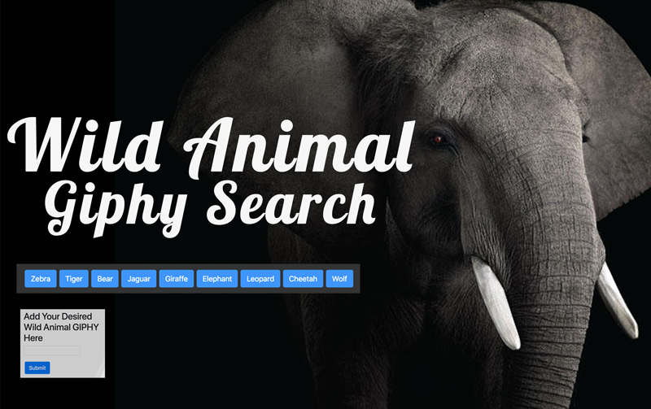
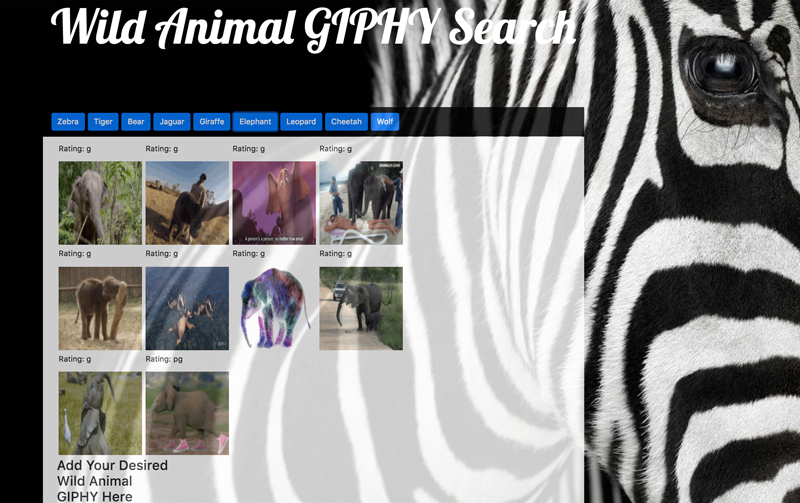

# Wild Animal Giphy Seach

## Overview
Web application that utilizes the GIPHY API. The application searches the GIPHY API to find gifs by pressing search buttons. There is a selection of buttons that are pre-defined, but users can create other buttons through the form on the right. Gifs are presented with their rating and can be played by pressing them.

## Home Page

## See it online at:
https://akt12345.github.io/Wild-Animal-Giphy-Search/

## Technologies Used:
AJAX

Bootstrap

JQuery

JavaScript

Giphy API

## Author
Abby Thoresen copyright 2018

Background Photo Credit to: Brad Wilson
